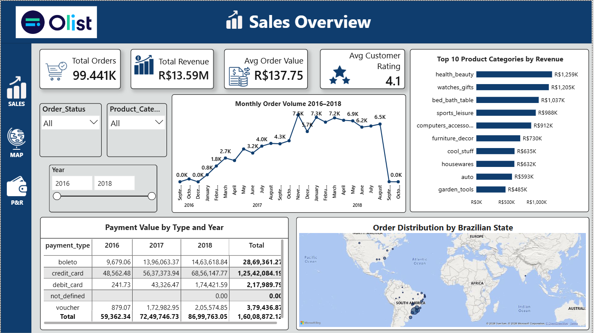
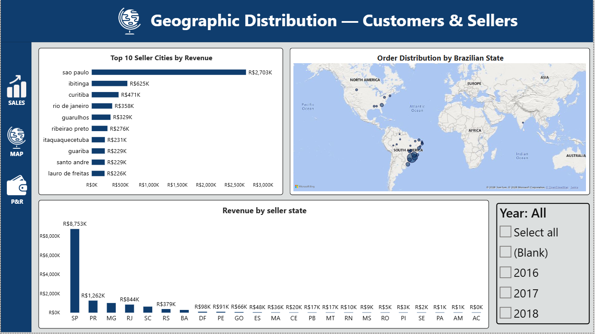
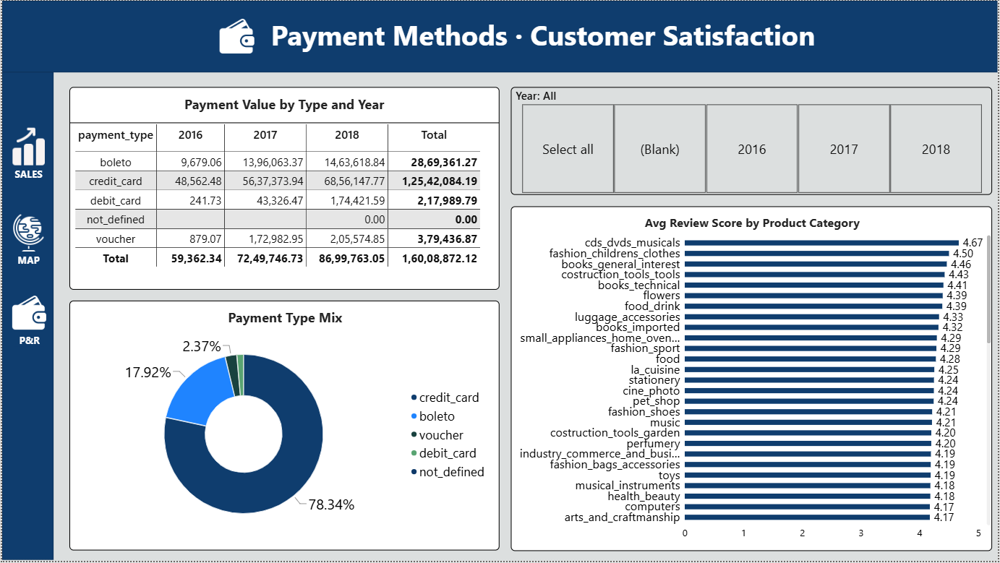

# 🛒 Brazilian E-Commerce Analytics — Power BI Dashboard

## 📊 Project Overview

This project is an interactive **Power BI Dashboard** created using the **Brazilian E-Commerce Public Dataset by Olist (Kaggle)**.

The dashboard analyzes e-commerce sales, orders, customers, sellers, payment methods, product categories, geographic distribution, and customer reviews.

The project focuses on data modelling, Star Schema, relationships, KPIs, interactive filters, drill-down analysis, and business insights.

## 📁 Dataset

Dataset: Brazilian E-Commerce Public Dataset by Olist
Source: Kaggle
Author: Olist (olistbr)

**Dataset Link:**
https://www.kaggle.com/datasets/olistbr/brazilian-ecommerce

The dataset contains 9 CSV files with approximately 100K+ e-commerce records across orders, order items, customers, products, sellers, payments, reviews, geolocation, and category translation data.

## 🛠️ Tools Used

* Microsoft Power BI Desktop
* Power Query
* DAX
* Kaggle
* GitHub

### Main Tables

* FactOrderItems
* DimOrders
* DimCustomers
* DimProducts
* DimSellers
* DimDate
* FactPayments
* FactReviews
* DimGeolocation


## 🏗️ Data Model

The Power BI project uses a Star Schema with FactOrderItems as the central fact table.

### Main Relationships

FactOrderItems[order_id] → DimOrders[order_id]
FactOrderItems[product_id] → DimProducts[product_id]
FactOrderItems[seller_id] → DimSellers[seller_id]
DimOrders[customer_id] → DimCustomers[customer_id]
DimDate[Date] → DimOrders[order_purchase_timestamp]
FactPayments[order_id] → DimOrders[order_id]
FactReviews[order_id] → DimOrders[order_id]

A dedicated DimDate calendar table is used for Year, Quarter, Month, Weekday, and time-based analysis.

## 📈 Dashboard Pages

### 1. Sales Overview
This page provides an overall view of e-commerce performance.

Includes:
* Total Orders KPI
* Total Revenue KPI
* Average Order Value KPI
* Average Customer Rating KPI
* Top 10 Product Categories by Revenue
* Monthly Order Volume
* Year, Order Status & Product Category Slicers




### 2. Geographic Analysis
This page focuses on the geographic distribution of customers and sellers.

Includes:
* Orders by Brazilian State
* Top Seller Cities by Revenue
* Revenue by Seller State
* Customer and Seller Location Analysis




### 3. Payments & Reviews
This page analyzes payment behaviour and customer satisfaction.

Includes:
* Payment Value by Type and Year
* Payment Type Mix
* Average Review Score by Product Category
* Customer Satisfaction Analysis




## 🔍 Power BI Features Used

* Power Query
* Data Cleaning & Transformation
* Data Modelling
* Star Schema
* Fact & Dimension Tables
* Primary Key / Foreign Key relationships
* Date Table
* DAX Measures
* KPI Cards
* Bar Charts
* Line Charts
* Column Charts
* Donut Chart
* Matrix
* Map Visual
* Slicers
* Filters
* Drill-down
* Hierarchies
* Conditional Formatting
* Data Categories
* Active & Inactive Relationships

📂 Repository Structure

```text
Brazilian-E-Commerce-PowerBI/
│
├── PR_3.pbix
├── README.md
├── sales_overview.png
├── geographic_view.png
├── payments_Method.png
└── Model_view.png
```


## 🎯 Project Objective

📌 Project Objectives

Build an interactive e-commerce analytics dashboard.
Understand and implement a Star Schema.
Create relationships between fact and dimension tables.
Create a dedicated Date dimension.
Analyze sales and order trends.
Understand payment methods and customer reviews.
Analyze customer and seller geographic distribution.
Use Power BI visuals, slicers, filters, and drill-down features.
Present business information through an interactive dashboard.

⭐ If you find this project useful

Feel free to explore the dashboard and dataset.
**Made with Power BI 📊**

## 👩‍💻 Author

**HAPPY PATEL**

Aspiring Data Analyst | Power BI | SQL | Python | Excel
